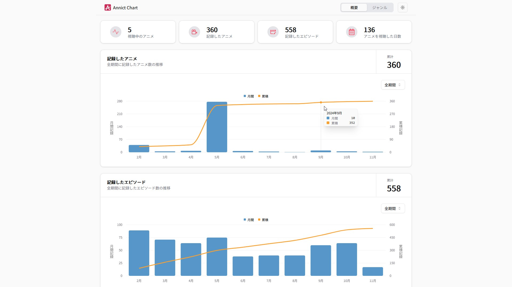

# Annict Chart

[Annict Chart](https://annict-chart.vercel.app/) は、Annict の視聴記録をグラフで可視化する非公式サービスです。

<picture>
  <source media="(prefers-color-scheme: dark)" srcset="./public/hero-image-dark.jp">
  <source media="(prefers-color-scheme: light)" srcset="./public/hero-image.jpg">
  
</picture>

## ビルド

```
pnpm i
pnpm dev
```

OAuth のために".env.local"ファイルを作成する必要があります。API はプロキシサーバーのドメインです。プロキシサーバーでシークレットクライアントをリクエストに追加し、Annict に送信しています。

```
NEXT_PUBLIC_REDIRECT_URI=http://localhost:3000/callback
NEXT_PUBLIC_CLIENT_ID=fjiaejfojeajfjeiofjaje
NEXT_PUBLIC_API_DOMAIN=https://example.com
NEXT_PUBLIC_API_URL=https://example.com/token
```

localstorage に key を"token"として Annict トークンを保存しておくことで、この OAuth を回避できます。
